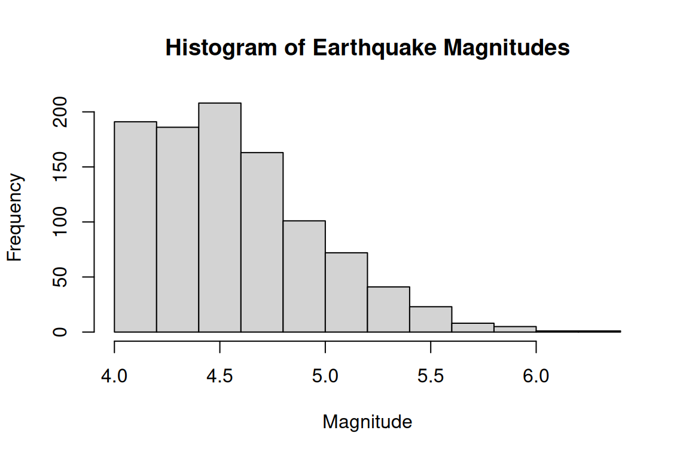
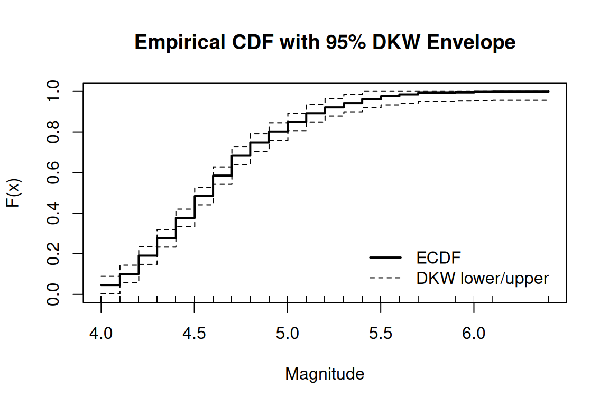

## Q2: Fiji quakes magnitudes
Read the data and compute the ECDF with a 95% DKW envelope. Plots are
captured automatically by knitr.


::: {.cell}

```{.r .cell-code}
# Read the data 
quakes <- read.table(
  file = "https://www.stat.cmu.edu/~larry/all-of-statistics/=data/fijiquakes.dat",
  header = TRUE
)
print(head(quakes))
```

::: {.cell-output .cell-output-stdout}

```
  Obs.    lat   long depth mag stations
1    1 -20.42 181.62   562 4.8       41
2    2 -20.62 181.03   650 4.2       15
3    3 -26.00 184.10    42 5.4       43
4    4 -17.97 181.66   626 4.1       19
5    5 -20.42 181.96   649 4.0       11
6    6 -19.68 184.31   195 4.0       12
```


:::

```{.r .cell-code}
# Extract magnitudes
x <- quakes$mag
n <- length(x)
stopifnot(is.numeric(x), n > 0)

# Empirical CDF
Fn <- ecdf(x)  

# DKW inequality:
alpha <- 0.05
eps <- sqrt( log(2/alpha) / (2*n) )
message(sprintf("n = %d, 95%% DKW epsilon = %.4f", n, eps))

# Evaluate the ECDF on a fine grid to draw smooth step lines
xs <- seq(min(x), max(x), length.out = 1000)
Fhat <- Fn(xs)

lower <- pmax(0, Fhat - eps)
upper <- pmin(1, Fhat + eps)

# Plot: histogram (mentioned in prompt)
hist(x, main = "Histogram of Earthquake Magnitudes", xlab = "Magnitude")
```

::: {.cell-output-display}
{width=576}
:::

```{.r .cell-code}
# ECDF + DKW envelope
plot(xs, Fhat, type = "s", lwd = 2, ylim = c(0, 1),
     xlab = "Magnitude", ylab = "F(x)",
     main = "Empirical CDF with 95% DKW Envelope")
lines(xs, lower, type = "s", lty = 2)
lines(xs, upper, type = "s", lty = 2)
rug(x)
legend("bottomright", inset = 0.02,
       legend = c("ECDF", "DKW lower/upper"),
       lwd = c(2, 1), lty = c(1, 2), bty = "n")
```

::: {.cell-output-display}
{width=576}
:::
:::


## Q3: Cloud seeding — difference in medians, bootstrap SE and 95% CI
Plug-in estimate is the observed difference in sample medians. Use a
nonparametric bootstrap (resample within group) to estimate SE, then a
Normal (Wald) 95% CI.


::: {.cell}

```{.r .cell-code}
# Load the data (ensure clouds.dat is in your working directory on SCF)
clouds <- read.table("clouds.dat", header = TRUE)

unseeded <- clouds$Unseeded
seeded   <- clouds$Seeded
n_un <- length(unseeded)
n_se <- length(seeded)

# Plug-in estimate: difference in medians
theta_hat <- median(seeded) - median(unseeded)

# Bootstrap to estimate SE and CI
set.seed(123)          # reproducibility
B <- 2000              # number of bootstrap samples
boot_thetas <- numeric(B)

for (b in 1:B) {
  boot_seeded   <- sample(seeded,   n_se, replace = TRUE)
  boot_unseeded <- sample(unseeded, n_un, replace = TRUE)
  boot_thetas[b] <- median(boot_seeded) - median(boot_unseeded)
}

# Bootstrap SE
se_theta_hat <- sd(boot_thetas)

# Normal-based 95% CI
z <- qnorm(0.975)      # ≈ 1.96
ci_lower <- theta_hat - z * se_theta_hat
ci_upper <- theta_hat + z * se_theta_hat

cat("theta_hat (median difference) =", theta_hat, "\n")
```

::: {.cell-output .cell-output-stdout}

```
theta_hat (median difference) = 177.4 
```


:::

```{.r .cell-code}
cat("Bootstrap SE =", se_theta_hat, "\n")
```

::: {.cell-output .cell-output-stdout}

```
Bootstrap SE = 61.8788 
```


:::

```{.r .cell-code}
cat("95% Normal CI = (", ci_lower, ",", ci_upper, ")\n")
```

::: {.cell-output .cell-output-stdout}

```
95% Normal CI = ( 56.11979 , 298.6802 )
```


:::
:::


